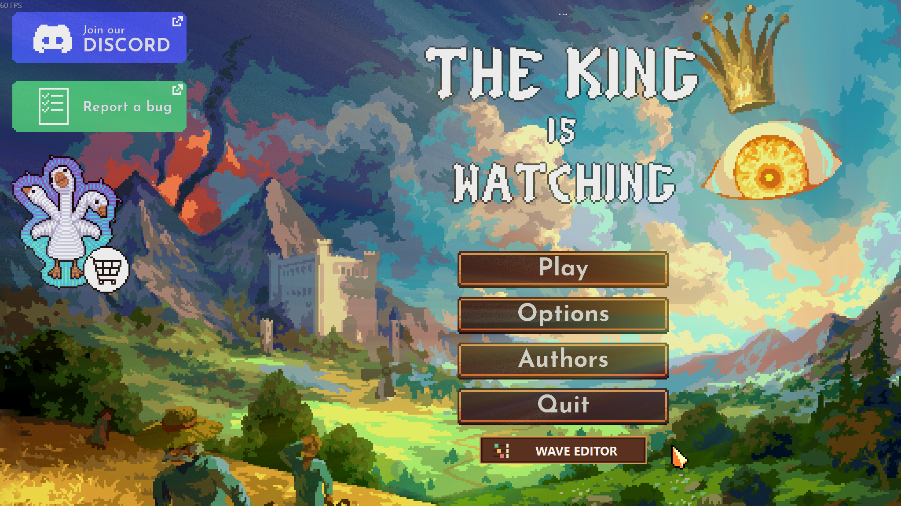
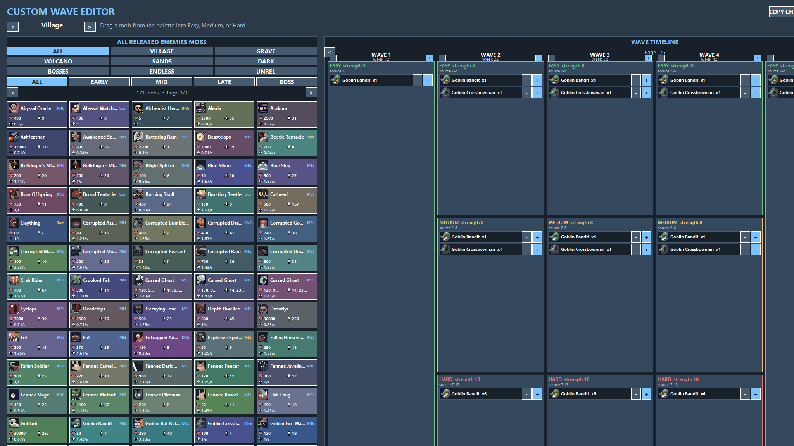

# The King is Watching — Custom Wave Editor

An unofficial in-game wave editor for **The King is Watching**. Design campaign waves visually, change their week, inspect enemy stats, and share one level at a time through the clipboard.

Tested with game version **1.3.2** on Windows.

## Screenshots





## One-file installation

1. Download `TKIW-Custom-Wave-Editor-Setup.exe` from the latest GitHub release.
2. Close the game.
3. Open the installer and approve the Windows administrator prompt.
4. Start the game normally through Steam.

The installer locates the Steam game automatically. If it cannot, it asks for the folder containing `The King is Watching.exe`. It installs the pinned official **Aurie 2.0.2** and **YYToolkit 4.0.1** dependencies, the editor DLL, and its UI assets.

The installer does not modify save files or wave CSV files. The editor creates backups before it writes wave files.

> The setup executable is not code-signed, so Windows SmartScreen may show an unknown-publisher warning. The complete installer and mod source are in this repository, and release hashes are published beside every build.

The full Visual Studio project is visible directly in this repository. GitHub also provides its standard source-code ZIP and tarball with every release.

### Manual installation without the setup executable

1. Install [official Aurie 2.0.2](https://github.com/AurieFramework/Aurie/releases/tag/v2.0.2) for your own copy of the game.
2. Download `TKIW-Custom-Wave-Editor-Manual-Install.zip` from the release.
3. Close the game and extract the ZIP into the main `The King is Watching` folder.
4. Confirm that `mods\aurie\10_CustomWaveEditor.dll` and `mods\aurie\CustomWaveEditorAssets` exist, then start the game through Steam.

This manual package contains the mod, its assets, the official pinned YYToolkit DLL, license notices, and a plain-text guide. It does not contain or run the automatic setup program.

## Using the editor

- Open **Wave Editor** on the title screen.
- Pick a campaign level.
- Drag enemies into the available Easy, Medium, and Hard wave cards.
- Use `+` and `-` to adjust counts. Click the visible `week N` field, type a week from 1 to 9999, and press Enter; the small `-`/`+` buttons remain available for quick changes.
- Press **Save** to apply the selected level.
- **Restore Defaults** restores the editor's original backup for that level.

### Sharing a challenge

1. Select the level you want to share.
2. Press **Copy Challenge**.
3. Send the copied text to another player.
4. They press **Paste Challenge** in their editor.

Copy/Paste contains only the selected level's presets and wave weeks. It does not contain other levels, Endless, player saves, unlocks, or progression.

## Features

- Drag-and-drop campaign wave editing
- Dynamic number of different enemy groups per wave
- Editable enemy counts and wave weeks
- Released, map, boss, Endless, and unreleased palette filters
- Localized in-game enemy names where available
- Always-visible HP, raw damage per hit, DPS, attack-speed, healing, and role information where available
- Resolution- and DPI-safe native layout with smooth cached rendering while dragging
- Per-level clipboard sharing
- Live campaign wave reload without restarting the application
- Automatic backups and restore-to-default support

## Building

Requirements:

- Windows 10 or 11
- Visual Studio 2022 Build Tools with the Desktop development with C++ workload
- PowerShell 5.1 or newer

Run:

```powershell
.\build-release.ps1
```

The build downloads the pinned official Aurie and YYToolkit release binaries, verifies their SHA-256 hashes, compiles the x64 mod, and creates the setup executable and minimal manual-install ZIP under `dist`.

Asset validation runs in GitHub Actions before every build. It checks the overlapping map groups, boss-only classification, complete icon/stat coverage, and safe DPS fallbacks. The release package is also exercised against a disposable game-folder copy before publication.

## Dependencies and attribution

- [Aurie Framework 2.0.2](https://github.com/AurieFramework/Aurie/releases/tag/v2.0.2)
- [YYToolkit 4.0.1](https://github.com/AurieFramework/YYToolkit/releases/tag/v4.0.1)

Both projects are licensed under AGPL-3.0. See [THIRD_PARTY_NOTICES.md](THIRD_PARTY_NOTICES.md) and the license copies in `third-party`.

The King is Watching, its names, and the small enemy images used for identification belong to their respective developer and publisher. This is a free, unofficial fan-made mod and is not affiliated with or endorsed by Hypnohead or tinyBuild. Game-derived images are not granted under this repository's AGPL license.

## License

Mod and installer source: **GNU Affero General Public License v3.0**, due to the Aurie/YYToolkit integration. See [LICENSE](LICENSE).
